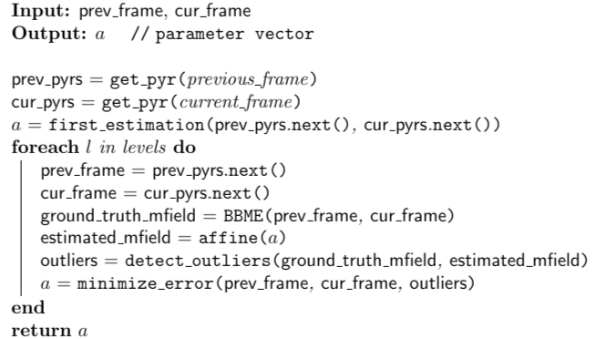

# An Indirect, Multiscale and Robust Approach to Global Motion Estimation
The problem of __global motion estimation__ (GME) deals with the separation, in a video sequence, of two different types of motion: the _egomotion_ of the camera recording the video, and the actual motion of the objects recorded. The literature presents a number of possible approaches to the GME problem; here, we aim to combine some of the most effective strategies to compute the motion of the camera. We adopt an indirect approach based on the affine motion model. Following a multi-resolution approach, at each level we compute the parameters of the motion model that minimize the error of the motion field. Then, we use those parameters to spot the outliers of the motion field in the next level; when computing the optimal parameters in the next level, we remove the detected outliers, in order to obtain a robust estimation.
Results are reported both in a qualitative and quantitative way. 



In the [project report](docs/report/main.pdf) ([docs](docs) folder) you can find more details of both foundations and implementation details.

## Modules
* `bbme.py`: module containing all the functions related to the various block matching motion estimation procedures that we have been trying;
* `motion.py`: module containing all the functions and constants needed in order to perform camera motion estimation and motion compensation
* `results.py`: example of use of the packages modules to produce the results we used also to create this report

## How to use
First of all, create a virtualenv and install the requirements:
```bash
python3 -m venv venv
source venv/bin/activate
pip install -r requirements
```
### Full cycle
To produce a full execution of the pipeline, you can run the `results.py` module as follows:

1. pick a video and put it in the [videos](global_motion_estimation/resources/videos/) folder
2. move into the module `cd ./global_motion_estimation`
3. run the script with `python3 ./results.py`
4. optionally set the frame distance (default is 3), e.g. `python3 ./results.py -f 5` 


### BBME module
The BBME module `bbme.py` can be run independently from the main pipeline and it accepts a variety of parameters:
```batch
usage: bbme.py [-h] -p PATH -fi FI [-pn PNORM] [-bs BLOCK_SIZE] [-sw SEARCH_WINDOW]
               [-sp SEARCHING_PROCEDURE]

Computes motion field between two frames using block matching algorithms

optional arguments:
  -h, --help            show this help message and exit
  -p PATH, --video-path PATH
                        path of the video to analyze
  -fi FI, --frame-index FI
                        index of the current frame to analyze in the video
  -pn PNORM, --p-norm PNORM
                        0: 1-norm (mae), 1: 2-norm (mse)
  -bs BLOCK_SIZE, --block-size BLOCK_SIZE
                        size of the block
  -sw SEARCH_WINDOW, --search-window SEARCH_WINDOW
                        size of the search window
  -sp SEARCHING_PROCEDURE, --searching-procedure SEARCHING_PROCEDURE
                        0: Exhaustive search,
                        1: Three Step search, 
                        2: 2D Log search, 
                        3: Diamond search


```
Basic usage:
1. pick a video to analyze
2. set the index of the anchor frame
3. adjust pnorm, searching procedure, search window and block size
4. run `python3 ./global_motion_estimation/bbme.py` 
5. find results in the [resources](global_motion_estimation/resources) folder

Example:
```bash
python3 ./global_motion_estimation/bbme.py -p ./global_motion_estimation/resources/videos/pan240.mp4 -fi 10 -bs 12 -sw 12 -sp 3
```

## Dataset
The videos we used to test the pipeline are available in [this Google Drive folder](https://drive.google.com/drive/folders/1gZisWe4DEWpb_CoHkTi6OKnxhl5Ca_mT?usp=sharing). Feel free to try it out with your own datasets.

In order to reduce computation time, we suggest to scale down higher-resolution videos to reasonable sizes, e.g.
```batch
ffmpeg -i full-res-video.mp4 scale=720:480 scaled-video.mp4
```

## How to navigate results
The `results.py` scripts on video `pan240.mp4`  yields the following result:
```bash
 ./global_motion_estimation/results/pan240
├──  compensated
│  ├──  0000.png
│  ├──  ........
│  └──  XXXX.png
├──  curr_comp_diff
│  ├──  0000.png
│  ├──  ........
│  └──  XXXX.png
├──  curr_prev_diff
│  ├──  0000.png
│  ├──  ........
│  └──  XXXX.png
├──  frames
│  ├──  0000.png
│  ├──  ........
│  └──  XXXX.png
├──  motion_model_field
│  ├──  0000.png
│  ├──  ........
│  └──  XXXX.png
└──  psnr_records.json
```

* **compensated**: collection of compensated previous frames
* **curr_comp_diff**: collection of images encompassing the absolute difference between frame _n_ and the compensated _n - 1_
* **curr_prev_diff**: collection of images encompassing the absolute difference between frame _n_ and _n - 1_
* **frames**: collection of all the frames of the video
* **motion_model_field**: collection of all the frames in the video on top of which it has been drawn a needle diagram representing the estimated global motion field
* **psnr_records.json**: JSON object holding the PSNR value for each pair of frames


## Configuration
This is how you change the default configuration:
* `bbme.py`: just type `python3 bbme.py -h` and go with the CLI arguments
* `results.py`: same 
* `motion.py`: open the [file](global_motion_estimation/motion.py) and change the constant declarations on top of the module

Better configuration management is soon to come.